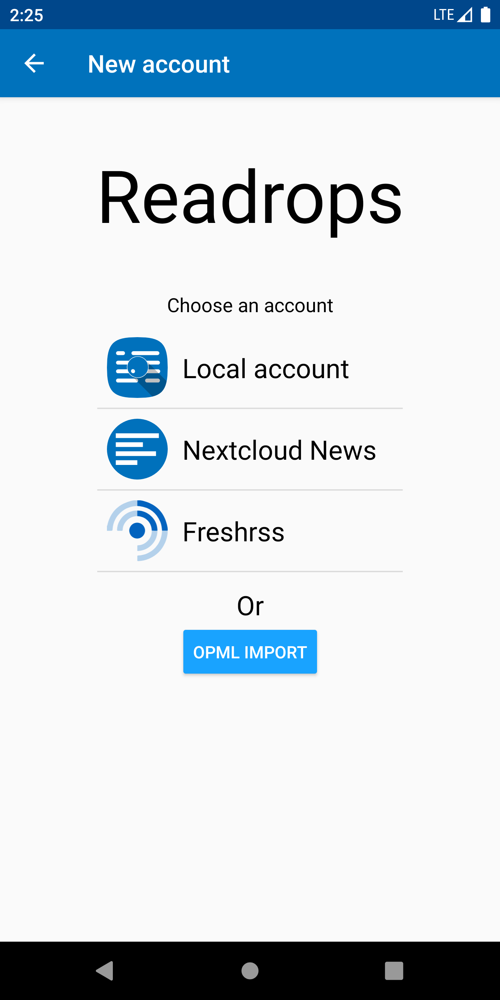
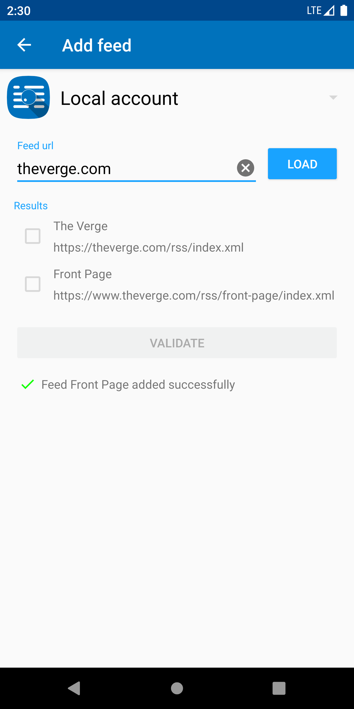
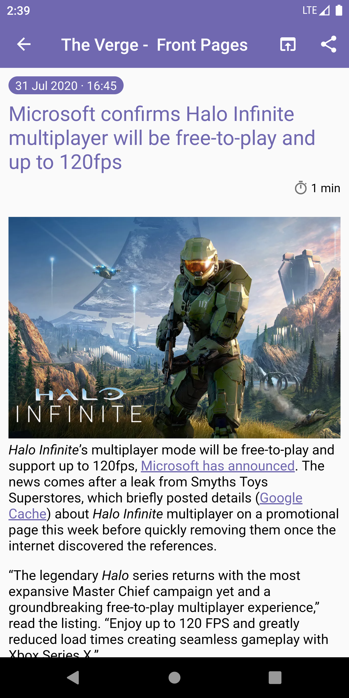
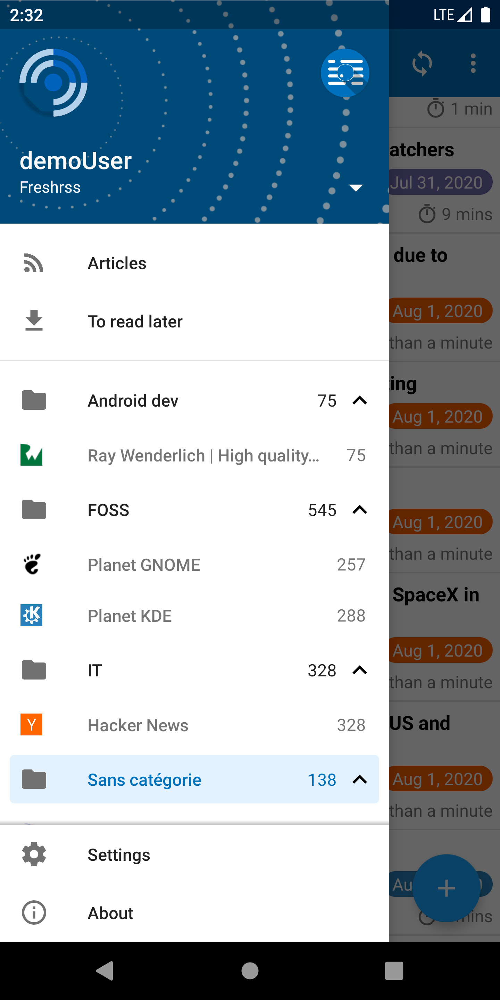
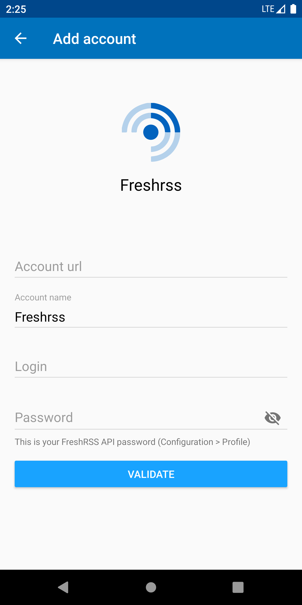
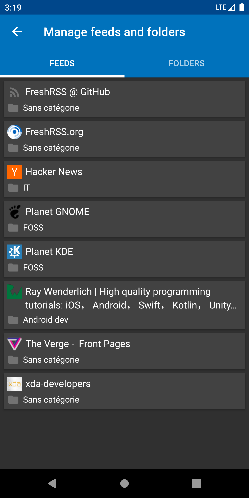

# Readrops 

Readrops is a multi-services RSS client for Android. Its name is composed of "Read" and "drops", where drops are information drops in an ocean of news.

# Screenshots

# Features

- Local RSS parsing
- RSS 2.0, ATOM and JSON formats support
- Multiple accounts
- Feeds and folders management (create, update and delete feeds/folders if your service API supports it)
- Nextcloud news support
- FreshRSS support

Other features will come in the near future.

# Licence

This project is released under the GPLv3 licence.

# Donations
Bitcoin address : bc1qlkzlcsvvtn3y6mek5umv5tc4ln09l64x6y42hr 
Litecoin address : MTuf45ZvxhMWWo4v8YBbFDTLsFcGtpcPNT
