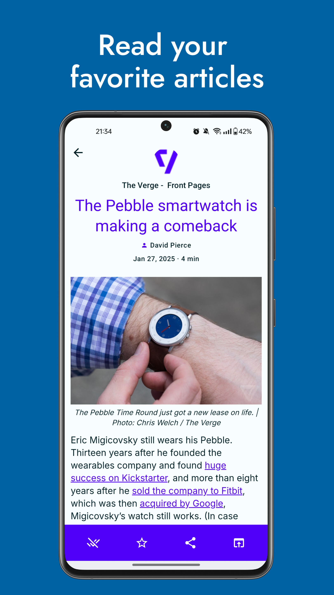
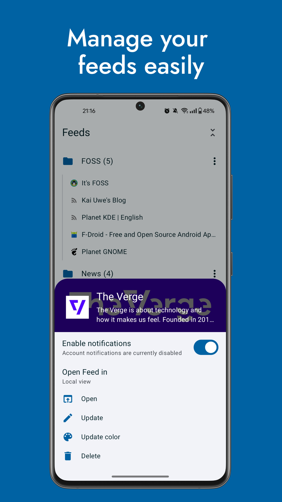
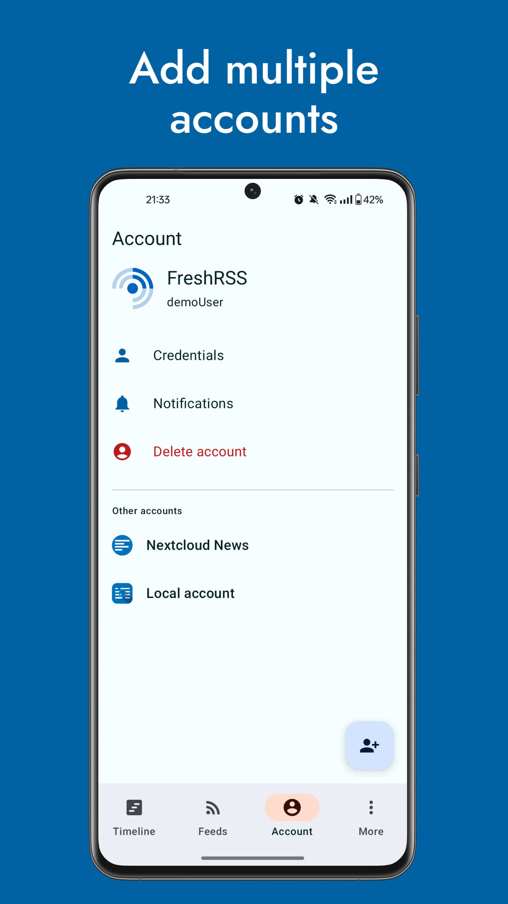
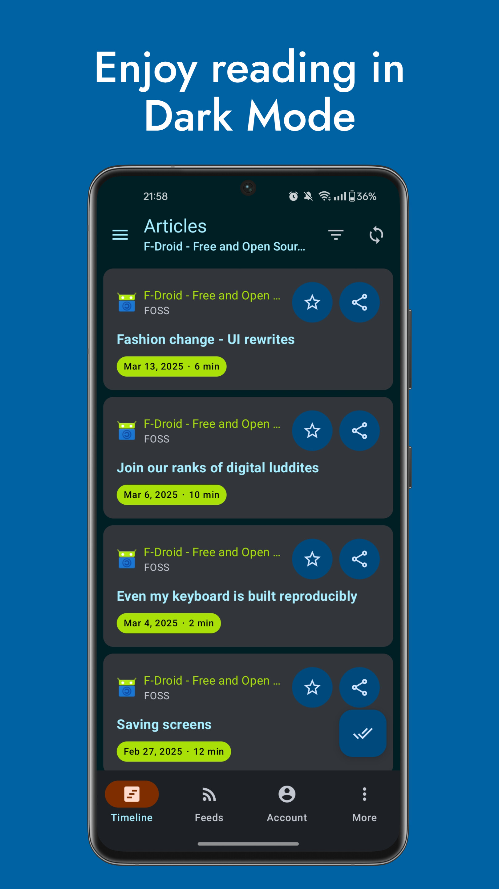

<p align="center">
    
</p>

<h1 align="center"><b>Readrops</b></h1>

<p align="center">
<a href="https://github.com/readrops/Readrops/actions"></a>
<a href="https://codecov.io/gh/readrops/Readrops"></a>
<a href="https://hosted.weblate.org/engage/readrops/"></a>

<h4 align="center">Readrops is a multi-services RSS client for Android. Its name is composed of "Read" and "drops", where drops are articles in an ocean of news.</h4>

<p align="center">
    <a href="https://play.google.com/store/apps/details?id=com.readrops.app"></a>
    <a href="https://f-droid.org/en/packages/com.readrops.app/"></a>
</p>

# Features

- Local RSS parsing (RSS1, RSS2, ATOM, JSONFeed)
- External services:
  - FreshRSS
  - Nextcloud News
  - Fever API
  - Google Reader API
- Multi-account
- Feeds and folders management (create, update and delete feeds/folders if supported by the service API)
- OPML import/export
- Background synchronisation
- Notifications

# Screenshots

   

  

# Licence

This project is released under the GPLv3 licence.

# Develop

During development, you can autofill the app's login form by filling the project's `local.properties` like so:

```properties
debug.<account_type>.login=<login>
debug.<account_type>.password=<password>
debug.<account_type>.url=https\://<your_instance>

# For instance:
debug.nextcloud_news.login=Test user
debug.nextcloud_news.password=1234
debug.nextcloud_news.url=https\://rss.example.com
```

# Donations

[](https://paypal.me/readropsapp)

Bitcoin address : `bc1qlkzlcsvvtn3y6mek5umv5tc4ln09l64x6y42hr` <br />
Litecoin address : `MTuf45ZvxhMWWo4v8YBbFDTLsFcGtpcPNT`
